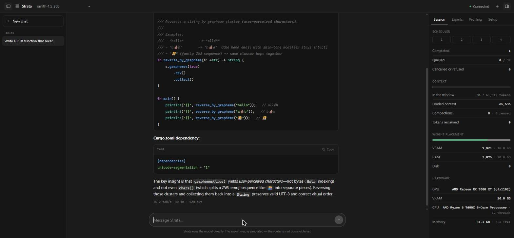
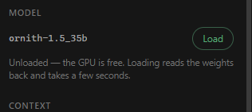

# Strata

**A local inference engine for mixture-of-experts models on AMD GPUs, written in Rust.**

[](LICENSE)
[](https://www.rust-lang.org/)
[]()
[]()

Strata runs large **MoE GGUF models on consumer AMD Radeon cards** — ROCm on
Windows, no Ollama and no daemon. It reads the model file itself, works out where
its weights should sit across VRAM and system RAM, starts and owns the
llama.cpp compute process, and serves an OpenAI-compatible API plus a web
console. It configures itself for whatever machine it lands on.

**35B MoE at ~42 tok/s on a 16 GB card, with a 65,536-token window.** No daemon,
no Ollama.



---

## What is Strata's, and what isn't

| | |
|---|---|
| GGUF parsing, model facts | **Strata** |
| Hardware detection, context selection | **Strata** |
| Weight placement across tiers | **Strata** |
| Tuning that placement by measurement | **Strata** |
| Context compaction | **Strata** |
| Compute process lifecycle and flags | **Strata** |
| OpenAI API, SSE streaming, scheduler, admission control, auth | **Strata** |
| Web console | **Strata** |
| **The matrix multiplies** | **llama.cpp**, fetched at setup |

The kernels are not Strata's. Everything around them is.

⚠️ The **expert map** in the console is **simulated**. The compute process does
not report which experts a token activated, so there is nothing real to draw.
`/experts` and `/health` return `"simulated": true`, and the console says so.

---

## Get started

### 1. Build

```powershell
git clone https://github.com/mehbul/strata
cd strata
cargo build --release
```

### 2. Fetch the compute runtime

Strata needs a llama.cpp build in `runtime/`. It is not committed.

```powershell
curl -L -o llama.zip https://github.com/ggml-org/llama.cpp/releases/download/b10679/llama-b10679-bin-win-rocm-7.14-x64.zip
Expand-Archive llama.zip -DestinationPath runtime
```

Verify — this must list your GPU:

```powershell
.\runtime\llama-server.exe --list-devices
#   ROCm0: AMD Radeon RX 7600 XT (16368 MiB, 16224 MiB free)
```

If it prints nothing, a backend library is missing. llama.cpp reports this as an
empty device list with nothing in its log, so test with `--list-devices` rather
than assuming the GPU is being used.

### 3. Get a model

Any MoE `.gguf` at `rocm/models/<name>/model.gguf`, or fetch one:

```powershell
.\target\release\strata.exe pull --model ornith-1.5:35b   # from Ollama
.\target\release\strata.exe pull --model owner/repo       # from Hugging Face
```

`pull` takes an Ollama model, resolved through Ollama's own manifests, or a
Hugging Face repository named in full. When a repository holds several
quantisations it lists them rather than choosing one:

```
TheBloke/TinyLlama-1.1B-Chat-v1.0-GGUF holds 12 GGUF files. Name one:
  tinyllama-1.1b-chat-v1.0.Q2_K.gguf
  ...
  strata pull --model TheBloke/TinyLlama-1.1B-Chat-v1.0-GGUF:<file>
```

The model lands at `rocm/models/<name>/model.gguf` under the name of the file
you picked, and `strata list` reads it back from its header.

### 4. Configure and serve

```powershell
.\strata.ps1
```

That is the whole thing. It builds what is stale, runs `setup` if this machine
has never been measured, and serves. Open <http://localhost:8080>.

`setup` can also be run on its own, and `--dry-run` reports its choices without
measuring or writing anything:

```
Strata setup

  runtime   runtime\llama-server.exe
  ROCm0  AMD Radeon RX 7600 XT — 16.0 GB <-- planning against this one
  ROCm1  AMD Radeon(TM) Graphics — 12.2 GB  (integrated; its memory is the host's)
  host      31 GB RAM, 25 GB free, 12 threads

  model     rocm/models\ornith-1.5_35b\model.gguf
  context   65536 — 1.25 GB of KV cache, 8% of the card
  resident  1.56 GB of dense weights before any expert
  ceiling   35 GB of weights fit without touching disk (16 GB VRAM + 21 GB free RAM)
```

---

## Measured findings

Everything below was measured on one machine — Ryzen 5 7600X, RX 7600 XT 16 GB
(gfx1102, RDNA3), 32 GB DDR5, Windows 11 — with Ornith-1.5-35B-A3B at Q4_K
(41 layers, 256 experts, top-8 routing).

### Putting everything on the GPU is the slowest option

| CPU-expert layers | tok/s | VRAM |
|---|---|---|
| 0 — everything on GPU | **18.9** | 14.77 GB |
| 12 | 27.6 | 14.55 GB |
| **15** | **42.5** | 14.96 GB |
| 21 | 33.8 | 11.23 GB |
| 31 | 27.9 | 6.81 GB |

Keeping some experts in host memory frees VRAM for the layers that remain.
Maximising residency is the slow choice, by more than 2×.

### Reading and writing want different splits

`tune` measures them separately, because they disagree about where experts
belong. Prefill is compute-bound and wants them on the GPU; decode is
memory-bound and tolerates them in host RAM.

```
   cpu-moe  prefill tok/s  decode tok/s     turn s    VRAM GB
------------------------------------------------------------
        16            342          38.8       37.2      14.53
        12            328          40.9       37.5      15.04
         0            271          20.2       55.6      15.07
------------------------------------------------------------
        15            353          42.5       35.3      14.96 <-- best
```

It minimises the wall time of a whole realistic turn — read 8192 tokens, write
512 — then re-measures either side of the winner. The refinement pass matters:
a coarse grid never tries 15, and 15 wins on *both* rates.

### Context is not free, and bigger is not better

The KV cache is allocated in full at load, so it is VRAM the experts never get.
`setup` picks the largest context whose cache stays under a tenth of the card.

| tokens actually in the window | ctx 262144 | **ctx 65536** |
|---|---|---|
| ~500 | 33.2 tok/s | **45.9 tok/s** |
| ~2,800 | 31.7 tok/s | **45.9 tok/s** |
| ~10,900 | 24.5 tok/s | **41.7 tok/s** |
| ~21,800 | — | **45.0 tok/s** |
| ~32,600 | — | **41.9 tok/s** |
| ~43,500 | **12.6 tok/s** | — |

At 65536 decode is flat out to 32k deep. At 262144 the 5 GiB cache starves the
experts of VRAM and it has already halved by 10k. The model *declares* a 262144
context and it does fit — it just is not worth it.

### Context compaction

A conversation that outgrows the window does not fail gracefully: llama.cpp
either rejects the prompt or drops the front of it, taking the system prompt and
the statement of the task with it. Strata measures every request with the
model's own tokenizer and, when one no longer fits, replaces the middle of the
conversation with a summary the model writes.

| | prompt tokens | first token |
|---|---|---|
| the turn that compacts | 56,916 → 24,198 | 199s |
| every turn after it | 24,198 | **0.3s** |

The second row is the point, and it comes from two decisions:

- **The cut is measured from the start of the conversation, not from its end.**
  Keeping the newest N tokens moves the cut every time a turn is added, so every
  turn would need a fresh summary. Cutting at a fixed distance from the
  beginning depends only on settled messages.
- **Because the cut does not move, the prompt prefix does not change**, and
  llama.cpp's KV cache still holds it — so the next turn skips prompt processing
  entirely.

The summary's budget scales with what it replaces (one eighth, floored at 512,
capped at 4096). At the default that is a 4,075-token record standing in for
32,718 tokens of history. In testing, four planted values — a hex constant, a
byte count, a retry count, a version string — all survived the drop.

---

## How much code fits

Measured with the model's own tokenizer against this repository's source:

| | tokens/line | lines in the window | before compaction |
|---|---|---|---|
| Rust | 10.7 | 6,133 | 4,604 |
| TypeScript | 8.8 | 7,429 | 5,577 |
| CSS | 7.6 | 8,582 | 6,442 |
| Markdown | 11.8 | 5,516 | 4,141 |

Roughly **6,600 lines at once**, or ~5,000 with comfortable room for the
conversation on top.

---

## Bigger models

`setup` reports what the machine can hold before it measures anything, and
**refuses** when more than half a model's experts would spill:

```
  ceiling   35 GB of weights fit without touching disk (16 GB VRAM + 21 GB free RAM)
```

There is no disk tier. Expert tensors are placed in VRAM or host memory and
nowhere else, so anything past the ceiling is the operating system faulting
pages out of the mmapped file. Decode touches a different handful of experts per
layer per token — a scattered read with almost no locality, bound by random
reads rather than bandwidth, and worth a fraction of a token per second.

For scale: a 200B MoE at Q4_K is ~112 GB, of which ~74% spills on a 16 GB / 32 GB
machine. Q2_K brings it to 58 GB and still spills ~42%. The honest answer for
that model is more RAM, not a different setting. `--allow-disk` measures it
anyway.

---

## The console



One conversation view; everything else behind a toggle.

- **Chat** — streaming, markdown, syntax-highlighted code blocks with copy,
  collapsible reasoning
- **Left rail** — saved conversations, grouped by age, stored in the browser
- **Inspector** — Model (load/unload, freeing the GPU without stopping the
  server), Context (window fill, compaction counts), Scheduler, Weight
  placement, Hardware, Experts (**simulated**), Profiling, Setup

Built automatically by `strata.ps1`, or by hand with `cd web && npm install && npm run build`.

---

## Use it with a coding agent

Strata forwards `tools` to llama.cpp and starts it with `--jinja`, so the model's
own chat template does the tool-call parsing. Any OpenAI-compatible coding agent
can drive it — the loop below was run end to end against Ornith-1.5-35B:

```
POST /v1/chat/completions  { "tools": [...] }
  -> finish_reason: "tool_calls", tool_calls[0].function.name = "read_file"
POST /v1/chat/completions  { ...assistant tool_calls, then role:"tool" result }
  -> the model reads the result and answers
```

Messages keep the fields Strata does not itself model. `tool_calls`,
`tool_call_id` and `name` travel through untouched, and `content` is accepted as
a string, as `null`, or as an array of content parts — the three shapes agents
actually send.

### pi

For [pi](https://github.com/earendil-works/pi-mono), add the provider to
`~/.pi/agent/models.json`:

```json
{
  "providers": {
    "strata": {
      "baseUrl": "http://127.0.0.1:8080/v1",
      "api": "openai-completions",
      "apiKey": "local",
      "compat": { "supportsDeveloperRole": false, "supportsReasoningEffort": false },
      "models": [{ "id": "<your model>", "contextWindow": 65536, "maxTokens": 8192 }]
    }
  }
}
```

Then `.\pi.ps1` serves the model if nothing is serving, waits for the weights,
and opens pi on it. Closing the agent leaves the engine up so the next one starts
instantly; `POST /model/unload` or the console's Unload button gives the memory
back, and the next run reloads it.

The same provider block works for anything that speaks OpenAI chat completions —
point the tool at `http://127.0.0.1:8080/v1` and give it any non-empty key.

---

## Commands

| | |
|---|---|
| `setup [--model <m>] [--force] [--dry-run] [--allow-disk]` | detect this machine, choose a context, measure the split |
| `info` | detected hardware and toolchain |
| `list` | models on disk, read from their GGUF headers |
| `inspect --path <gguf>` | everything a model file declares about itself |
| `plan --model <m> [--ctx] [--vram] [--ram]` | where the weights would sit |
| `tune --model <m> [--ctx] [--kv-type T] [--save]` | measure the fastest split on this machine |
| `pull --model <m>` | fetch a model: an Ollama name, or `owner/repo[:file.gguf]` from Hugging Face |
| `serve --model <m> [--ctx] [--cpu-moe N] [--no-compact] [--kv-type T] [--api-key K]` | load and serve |

Tuning results are stored per context as `tuned-<ctx>.json`, because the KV
cache reserved at load is VRAM the experts cannot have — a split measured at
8192 is wrong at 65536.

### Endpoints

| | |
|---|---|
| `GET /v1/models` | model list |
| `POST /v1/chat/completions` | OpenAI chat, SSE when `stream: true` |
| `GET /health` | scheduler, model residency, context, tiers, hardware |
| `GET /compact` | compaction settings and what it has done |
| `GET /profile` | per-turn timing |
| `GET /experts` | expert grid (**simulated**) |
| `POST /model/load`, `POST /model/unload` | free and reclaim the GPU |

Every completion carries its accounting in the response headers, so a client
that is not the console can see it:

```
x-strata-context-tokens    3476    prompt actually sent
x-strata-context-budget    8000    what it is measured against
x-strata-compacted         1       whether history was rewritten
x-strata-compacted-tokens  4100    how much was reclaimed
```

Fields Strata does not model — `tools`, `stop`, `top_p`, `seed`,
`response_format` — are forwarded untouched, so an editor or coding agent
behaves as it would talking to llama.cpp directly.

---

## Security

`serve` defaults to `127.0.0.1:8080`, which only the local machine can reach,
and runs without a key there.

**Any other address is refused unless `--api-key` (or `STRATA_API_KEY`) is
set.** A public port with no key hands the GPU to whatever can reach it,
including `/model/unload`. With a key set, every API request must carry it as
`Authorization: Bearer <key>` or `x-api-key: <key>`; keys are compared in
constant time. Static files stay open so the console can load and ask for one,
which it stores in the browser under Setup.

⚠️ There is no per-user anything. A key is a door, not an account.

---

## Hardware

Developed against:

```
CPU:  AMD Ryzen 5 7600X 6C12T
GPU:  AMD Radeon RX 7600 XT 16GB (gfx1102, Navi33, RDNA3)
RAM:  32GB DDR5
OS:   Windows 11 Pro
```

Nothing is hardcoded to it. Hardware comes from the compute runtime's own device
list, which needs no vendor SDK and answers the same for ROCm, Vulkan and CUDA;
context and split are chosen and measured per machine. On 8 GB `setup` picks
32768, on 4 GB 16384.

**Memory warning.** A 20 GB model plus its KV cache can push a 32 GB machine
near its commit limit. Strata itself uses ~17 MB; the compute process is what
grows. Lower `--ctx` or raise `--cpu-moe` if the machine gets tight.

---

## Questions

### Will it run on my card?

Hardware comes from the compute runtime's own device list, so anything that
llama.cpp's ROCm build enumerates works — RDNA2 and RDNA3 Radeon cards including
the RX 6700/6800/6900, RX 7600/7700/7800/7900 and gfx1102/gfx1100/gfx1200
targets. That list needs no vendor SDK and answers the same way for Vulkan and
CUDA builds. Development and every measurement here are on an RX 7600 XT 16 GB.

### Can I run a 35B model on 16 GB of VRAM?

Yes — that is the case this was built for. A 35B MoE at Q4_K runs at ~42 tok/s
with a 65,536-token window, by keeping 15 of 41 layers' experts in host RAM
rather than trying to fit everything on the card. Filling VRAM is the *slow*
choice here, by more than 2×.

### Do I need Ollama, LM Studio or a daemon?

No. Strata starts and owns the llama.cpp process directly and exits with it.
`pull` can copy a model out of an Ollama blob store if you already have one.

### Does it work on Linux?

The engine is developed and measured on Windows 11, and `strata.ps1` is
PowerShell. The Rust code has a Linux path for memory reporting and no Windows
API elsewhere, but nothing here has been measured on Linux — treat it as
untested rather than supported.

### Why is my GPU not being used?

Run `.
untime\llama-server.exe --list-devices`. A missing backend library
shows up as an empty device list and nothing in the log, so the GPU silently
disappears and everything falls back to CPU. Strata puts the runtime's own
library directory and any ROCm redistributables it can find on the loader path
before starting the process.

### What happens when a conversation outgrows the window?

Strata measures every request with the model's tokenizer and, past the
threshold, replaces the middle of the conversation with a summary the model
writes. The cut is measured from the start of the conversation so the prompt
prefix stays stable and llama.cpp's KV cache still holds it — which is why the
turn after a compaction costs 0.3s to first token instead of 199s.

---

## Notes

Longer documents behind the decisions above:

- [Engine notes](docs/LEARNING.md) — the model these choices were measured
  against, why placement and tuning work the way they do, and what is intended
  but not built.
- [Design](docs/DESIGN.md) — the console's visual system, recorded from the
  built interface: tokens, structure, motion, and the rules that keep it honest
  about what the engine does not do yet.
- [Product](docs/PRODUCT.md) — who this is for, what works today, and what
  belongs to llama.cpp rather than to Strata.

---

## Roadmap

Making the math Strata's own, in order, each step verifiable against the current
runtime on the same machine:

- [x] GGUF reader
- [x] Placement solved from measured bytes
- [x] Measured tuning, over prefill and decode
- [x] Hardware detection and per-machine setup
- [x] Context compaction
- [ ] Placement search over `-ot` patterns, not just a single cut point
- [ ] Q4_K / Q6_K dequantisation, checked against a reference
- [ ] BPE tokenizer over the file's own 248k vocab
- [ ] Forward pass — for this model a gated-DeltaNet SSM scan plus 256-expert
      routing, which is the hard part
- [ ] HIP kernels for gfx1102
- [ ] Real router telemetry, replacing the simulated expert map

Expert prefetching is not on this list until the forward pass is: predicting the
next token's experts requires intercepting a routing decision, and llama.cpp
exposes none. That is the same reason `/experts` is still simulated.

---

## License

Apache-2.0 — see [LICENSE](LICENSE).

`runtime/` is llama.cpp (MIT) plus AMD ROCm redistributables, fetched at setup
and not part of this repository. Model weights are not distributed here.
